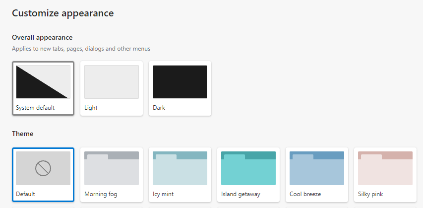

Appearance (Theme) API
===

# Background
This API's main use is to set the overall appearance for WebView2. The options are similar to Edge: match the system default theme, change to light theme, or change to dark theme. 
This API has 2 main changes relevant to the end users. First, it sets appearance for WebView2 UI like dialogs, prompts, context menu, etc. And second, this API sets the ['prefers-color-scheme'](https://developer.mozilla.org/en-US/docs/Web/CSS/@media/prefers-color-scheme) [media feature](https://developer.mozilla.org/en-US/docs/Web/CSS/Media_Queries/Using_media_queries#media_features). Websites typically media query for this setting in order to set CSS themes for light/dark. 

Please note this API will only set the overall appearance, but not theme.
For reference, in the screenshot below, this API is meant to expose the Overall Appearance section as a WebView2 API. 


# Examples

### C++

```cpp

bool ViewComponent::SetAppearance(COREWEBVIEW2_APPEARANCE_KIND value)
{
    
    wil::com_ptr<ICoreWebView2StagingController2> webViewStagingController2;

    m_appWindow->GetWebViewController()->QueryInterface(IID_PPV_ARGS(&webViewStagingController2));
    CHECK_FEATURE_RETURN(webViewStagingController2);

    webViewStagingController2->put_Appearance(value); 

    return true;
}
    
```
### C#

```c#

private WebView2 m_webview;

void SetAppearance(COREWEBVIEW2_APPEARANCE_KIND value)
{
    m_webview.CoreWebView2Controller.Appearance = value;
}
    
```

# API Details

```
[uuid(5f817cce-5d36-4cd0-a1d5-aaaf95c8685f), object, pointer_default(unique)]
interface ICoreWebView2Controller4 : ICoreWebView2Controller3 {

  /// The Appearance property sets the overall theme of the webview2 instance. 
  /// The input parameter is either COREWEBVIEW2_APPEARANCE_KIND_SYSTEM, 
  /// COREWEBVIEW2_APPEARANCE_KIND_LIGHT, or COREWEBVIEW2_APPEARANCE_KIND_DARK.
  /// Note that this API applies appearance to WebView2 pages, dialogs, menus,
  /// and sets the media feature `prefers-color-scheme` for websites to respond to. 
  
  /// Returns the value of the `Appearance` property.
  [propget] HRESULT Appearance(
  [out, retval] COREWEBVIEW2_APPEARANCE_KIND* value);

  /// Sets the `Appearance` property.
  [propput] HRESULT Appearance(
    [in] COREWEBVIEW2_APPEARANCE_KIND value);

}
```
```
/// An enum to represent the options for WebView2 appearance: system, light, or dark.

[v1_enum]
typedef enum COREWEBVIEW2_APPEARANCE_KIND {

  /// System theme
  COREWEBVIEW2_APPEARANCE_KIND_SYSTEM,

  /// Light theme
  COREWEBVIEW2_APPEARANCE_KIND_LIGHT,

  /// Dark theme
  COREWEBVIEW2_APPEARANCE_KIND_DARK

} COREWEBVIEW2_APPEARANCE_KIND;

```

### WinRT
```
[interface_name("Microsoft.Web.WebView2.Core.ICoreWebView2StagingController2")]
{
    // ICoreWebView2StagingController2 members
    [doc_string("")]
    CoreWebView2AppearanceKind Appearance { get; set; };

}
```
